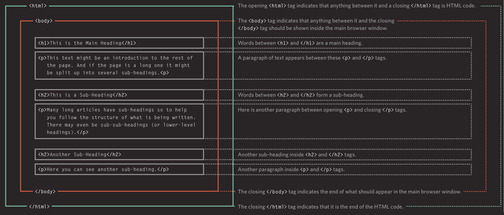
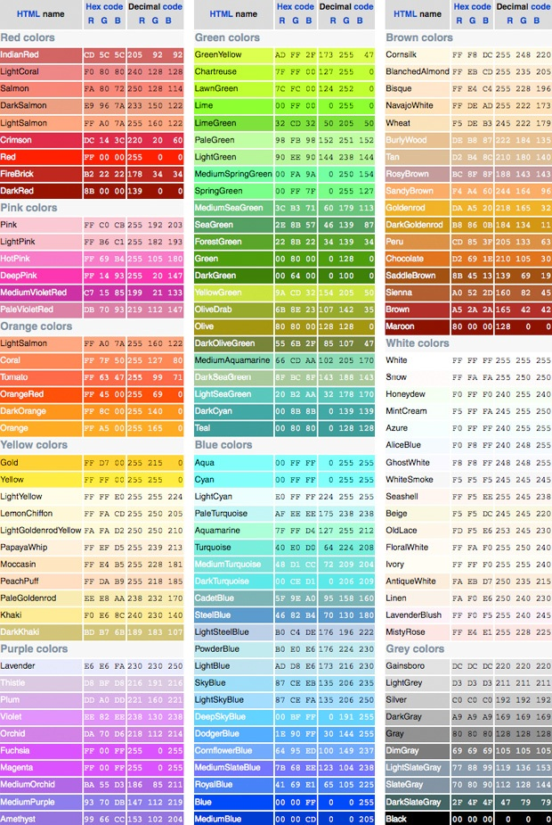
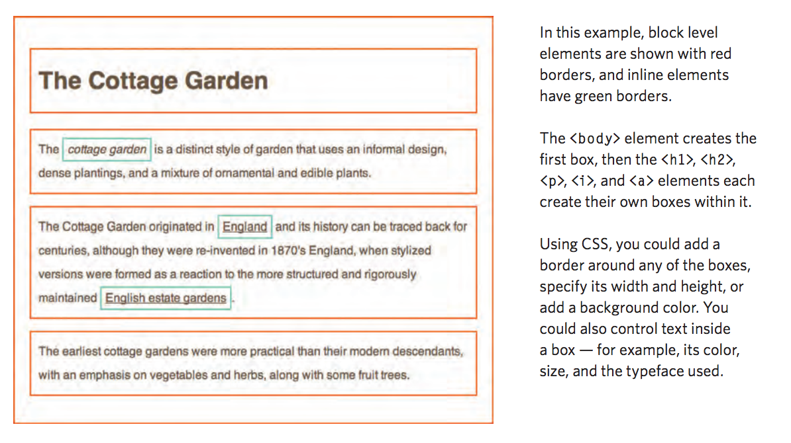
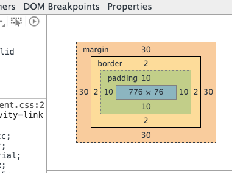
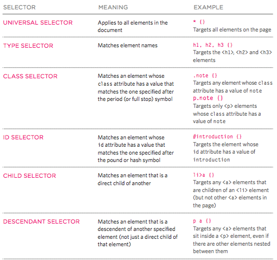
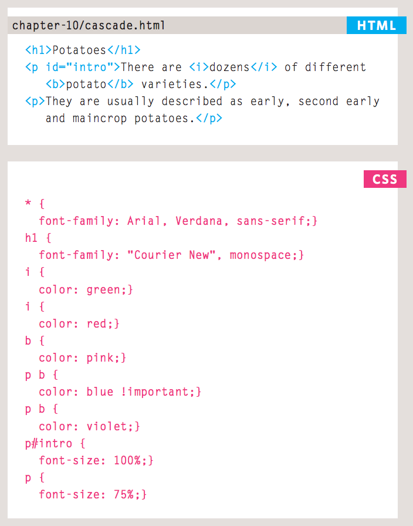

# HTML & CSS MINI SPRINT

### Viewing HTML Code



Open [this simple HTML file](http://reactorprep.herokuapp.com/students/examples/1-basic-html.html) and view its source `[CMD + OPTION + U]`. Use the Elements panel of the Chrome developer tools [CMD + OPTION + I] to answer the following questions:

1.  What font-size does the browser give an `<h1>` element by default?
1. What font-weight does the browser give an `<h1>` element by default?
1.  How does the browser render the extra spaces and new lines in the last paragraph?
1.  Are there any parts of the body that are not rendered into the browser window?


Now check out [this page](http://reactorprep.herokuapp.com/students/examples/2-basic-html.html). Use the Elements panel of the Chrome developer tools `[CMD + OPT + I]` to answer the following questions:

1.  What font-size does the browser give an `<h2>` element by default?
1.  What font-size does the browser give an `<h6>` element by default?
1.  What font-style does the browser give an `<em>` element by default?
1.  What text-decoration does the browser give an `<a>` element by default?
1.  What list-style-type does the browser give an `<li>` element which is a child of a `<ul>` by default?

### Building a simple web page

1.  Correctly set up an HTML document with a head and body tag
1.  The page should have a title tag in the head
1.  Use different sizes of header tags
1.  Use ordered and unordered lists
1.  Use some `<div>` and `<span>` tags
1.  Use some `<em>` and `<b>` tags
1.  Use some `<br>` and `<hr>` tags
1.  Include some images with the `<src>` tag
1.  Link to some external websites with the `<a>` tag
1.  Create a "navigation bar" to allow users to click between multiple HTML pages on your site
1.  We need easter eggs! Have at least a few SECRET COMMENTS that visitors can only see if they view your source code!

# CSS



Colors can be described by name, as eight digit hex (base 16) values between 0 (black) and F (white), or as Red Green Blue triplets from 0 to 255

```html
<html>
  <head>
  <style>
    h1 {
        font-family: verdana;
        color: rgb(255,50,120);
    }

    p {
      color: #008000;
    }

    .big {
      font-size: 300%;
    }

    #primary {
      text-align: center;
      font-family: 'Times New Roman';
    }

    .important {
      background-color: orange;
    }
  </style>
  </head>
  <body>
    <h1 class="important">This is a heading</h1>
    <p>This <i class="important big">is</i> a paragraph.</p>
    <p>This <i class="big">is</i> a paragraph.</p>
    <p  id="primary" class="big">This is by far the most important part of the page!</p>
  </body>
<html>
```

### Adding CSS

1. Use all three styles of declaring CSS colors in your HTML document.
2. Add CSS rules that target a mix of class, id, and tag selectors, give elements on your page different background-colors.

## The Box Model

HTML documents are laid out according to the "box model", whereby each HTML element is rendered into its own border, margin (outside the border), and padding (inside the border).



You can observe this by using your browser's Elements inspector.



Add the following to your HTML to see the borders of each element's box.

```html
<style>
  * {
    border: 1px solid red;
  }
</style>
```
Give some of your elements a set height, width, border, padding, and margin, as below.

```html
<style>
	div {
    padding: 10px;
    margin: 30px;
    box-sizing: border-box;
    width: 300px;
    height: 200px;
	}
</style>
```

**Answer the following questions:**

1. What happens when you give an element so much padding that it's larger than the height and width screen
1. Figure out what "giving" an element each of these css rules does:
  - border-radius: 10px;
  - margin-top: 20px;
  - padding-right: 20px;
  - border-left: 10px solid red;
  - padding: 20px 10px;
  - padding: 20px 5px 10px;
  - padding: 20px 5px 10px 50px;

Try working with some of the more complicated selector types below:



Understand the specificity rules that govern the final appearance of the below page:



### Choose Your Own Adventure

Create a series of html pages for a text-based "choose your own adventure" story, so that users can click different links to make choices to advance the story as they see fit.

1. Use the `<link rel="stylesheet" href="styles.css">` in the `<head>` to share a common css file amongst all pages 
1. Each page should have multiple links to choose the next page, and perhaps sometimes a link to jump back to the last page or even to the beginning
1. Use some div and span elements
1. Use some class and id attributes
1. Use some padding, margin, and border css properties
1. Use some complex css selectors
1. Use some css rules that are more specific and thus overwrite other more general rules for a particular element


## FORMS

```html
<!--
  The action attribute defines where on the server the form data should be sent
  The method attribute specifies the HTTP method (GET or POST)
-->

<form action="form-responses/new" method="POST">

  <input type="text" name="firstname" value="default" size="100" autofocus>
  <input type="password" name="pswd">
  <input type="email" name="userEmail" placeholder="hello@site.com">

  <input type="radio" name="weird" value="code-blue" checked><span>pick this!</span>
  <input type="radio" name="weird" value="code-red" checked><span>or pick this</span>

  <input type="checkbox" name="optin" value="trusting" checked>You agree to everything
  <input type="checkbox" name="optout" value="skeptical" disabled>Wait, what?

  <select name="car">
    <optgroup label="Swedish Cars">
      <option value="boring">Volvo</option>
      <option value="cool">Honda</option>
    </optgroup>
  </select>

  <textarea name="user_message" rows="8" cols="40"></textarea>
  <input type="submit">
</form>

<!--
  HERE IS THE BODY OF THE 'POST' NETWORK REQUEST GENERATED UPON 'SUBMIT'
  firstname=user+numero+uno&pswd=secretstuff&userEmail=me%40site.com&weird=code-blue&optin=sucker&car=boring&userMessage=what+about++++spaces%3F%0D%0Aand%0D%0A+++indentation%3F
-->
```

Copy this form into your document and understand how it works.

HTML5 gives us fancy new input types. Give them all a try by setting the type attribute of an input element to the following:

- color
- date
- datetime
- datetime-local
- file
- email
- month
- number
- range
- search
- tel
- time
- url
- week

## PAGE LAYOUT

Visit [Learn Layout](http://learnlayout.com/) and follow along using your own HTML document as a code playground.

Follow along with [this flexbox tutorial](https://medium.freecodecamp.org/an-animated-guide-to-flexbox-d280cf6afc35) and try [these exercises](http://flexboxfroggy.com/) to understand the new Flexbox positioning mode.

Try using the popular [Bootstrap](http://getbootstrap.com/) CSS framework to design a web page or site.
